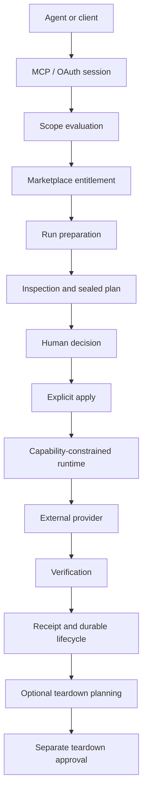

# BoxFetch Architecture

## Architectural objective

BoxFetch separates commercial entitlement, agent authority, human approval, execution capability, provider mutation, and audit evidence. The system is designed so no one token, UI action, or tool call implicitly carries all of those powers.

## System flow

## Runtime planes

BoxFetch keeps identity, product state, and external provider authority separate.

- **Identity plane:** users, authentication, and approved shared security operations.
- **Product plane:** marketplace, credits, purchases, entitlements, agents, OAuth/MCP grants, controlled runs, and operational evidence.
- **Provider plane:** external mutation behind reviewed adapters and capability grants.

The separation reduces accidental authority coupling between authentication and economic action.

## Agent boundary

Protected MCP sessions expose only tools authorized by the current grant. Scope step-up is incremental. A client can receive a structured challenge describing the next required authority, but it cannot silently self-elevate.

The agent-facing run projection is intentionally narrower than the owner-facing view. Sensitive provider connection details, secret values, full plan bodies, and full receipts are not required for an agent to reason about lifecycle state.

## Owner boundary

The human owner controls provider connection selection, exact plan approval, apply, cancellation, teardown approval, and teardown execution through a separate authenticated surface.

Approval and execution remain separate actions. A human approving a plan does not automatically dispatch the provider mutation.

## Controlled execution runtime

The runtime accepts only reviewed implementations and capability grants. Important constraints include:

- default-deny executable access
- implementation-scoped HTTPS hosts
- redirect re-authorization
- rooted and symlink-contained filesystem access
- allowlisted child-process environment
- secret redaction from surfaced output and exceptions
- no arbitrary package-supplied shell
- no dynamic execution of arbitrary package JavaScript

## Concurrency and replay

State transitions are transactional and mutations require idempotency keys. Approval decisions bind to exact digests re-read inside the transition boundary. Concurrent re-planning cannot inherit an older approval.

Provider ambiguity is represented explicitly as reconciliation-required state. Forward mutation is withheld rather than retried automatically.

## Teardown

Teardown has its own planning and approval lifecycle because deletion is not merely the inverse of creation. The system binds teardown decisions to exact reviewed state and preserves ambiguity when provider evidence is insufficient.
