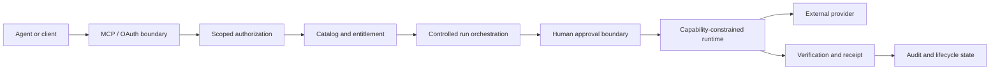
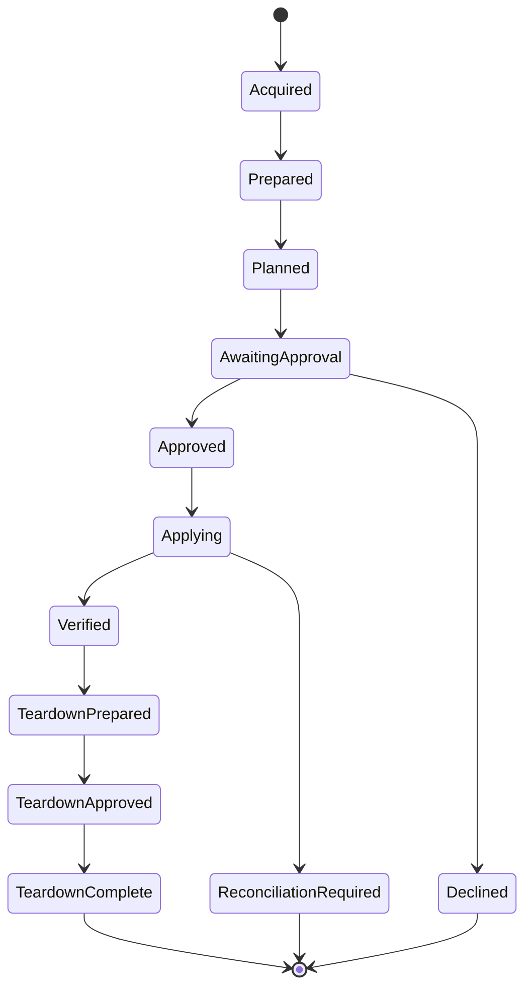

# Agent Authorization & Controlled Execution

## Independent systems research on authorization and consequential AI actions

This case study examines a consequential problem in agentic systems: how to let software acquire and execute useful capabilities while keeping money, credentials, infrastructure changes, and deletion under explicit authority.

The implementation remains private. This case study covers the control architecture, the corrections that shaped it, and the evidence used to decide when an execution path is ready.

This system was briefly tested as a product concept, but it did not become an ongoing commercial operation and has no current customers or production users.

## My role

I designed and built this system independently. I own the authority architecture, acceptance criteria, and evidence standard used to decide when an execution path is ready. I review implementation through source, tests, proof harnesses, and end-to-end system evidence. AI-assisted engineering tools are part of the build workflow; technical direction and acceptance remain mine.

**Period:** built and evaluated during 2026.  
**Current status:** the authenticated catalog and agent surfaces, OAuth/MCP access, controlled-run orchestration, owner approval UI, durable execution state, constrained standalone runtime, signed runtime distribution, and one-step package acquisition handoff are implemented. Six canonical reference packages exist; one has a reviewed hosted execution path, while the others remain acquisition-only until their execution adapters earn separate evidence.

## Problem

Once an agent can create economic or operational consequences, tool access is no longer the hard part. The system has to answer more demanding questions:

- what the agent is authorized to do now
- which decisions require a human
- whether a request can be replayed or duplicated
- what happens after an ambiguous provider response
- whether acquisition entitlement implies execution authority
- how permissions step up without silently broadening the rest of the grant
- whether spending limits remain enforceable across repeated actions
- whether durable evidence exists for what was approved, executed, verified, or torn down

## System shape

No single interface owns the full authority chain.

## Core architecture

### Scope model

The system uses OAuth authorization-code flow with PKCE and protected MCP sessions. Access is divided into explicit scopes rather than treating a valid session as universal authority.

The reference catalog exposes acquisition-oriented and controlled-run tools through separate authority surfaces. Run authority is absent from the default acquisition grant, so discovering a capability and being allowed to execute it are separate facts.

A later corrective pass added a single one-step acquisition facade that returns a runtime-ready handoff for an already selected exact package. It composes existing quote, acquisition, entitlement, delivery, and runtime-resolution authorities rather than creating a second authority path. The request identity binds every accepted semantic field so an idempotency key cannot be reused with a materially different request body.

### Entitlement versus execution

Catalog acquisition, entitlement, provider connection, execution planning, human approval, apply, verification, and teardown are distinct states. Acquisition therefore does not silently become operational authority.

### Human approval binds to exact state

Approval binds to a specific sealed plan digest. If the underlying plan changes concurrently, the earlier decision cannot authorize the new state. Teardown uses the same principle.

### Replay and economic controls

Mutations require caller-supplied idempotency keys and pass through transactional state transitions. Agent acquisition permissions and spending limits are persisted controls rather than conversational instructions.

The controlled-run mutation and recovery register currently contains **161 registered cases**, all machine-mapped to their intended proof references. The register separates contract-only coverage from cases that require direct observation, so a green test is not mislabeled as provider evidence.

### Capability-constrained runtime

The standalone runtime uses implementation-specific capability grants with default-deny boundaries for executable access, network destinations, filesystem access, environment exposure, and secret handling. It does not dynamically execute arbitrary package-supplied JavaScript, shell, or plugins.

The distribution rail resolves immutable signed runtime descriptors, verifies artifacts against a pinned trust root, enforces streaming size bounds, and uses revocation-aware cache validation. A warm cache is not treated as indefinite execution authority.

### Reconciliation as a safety state

A provider request can leave the local system uncertain about what actually happened. The system represents that ambiguity explicitly. Forward mutation is withheld because automatically retrying an uncertain external mutation can duplicate the consequence.

## Representative lifecycle

`ReconciliationRequired` is a peer of `Verified`, not a retry loop.

## What changed after red-team testing

An earlier agent surface placed capability discovery and executable actions behind an authority boundary that was too broad. Red-team testing showed that session validity, tool visibility, and mutation authority could be too easily conflated.

The architecture was narrowed structurally. Onboarding, hosted OAuth, acquisition authority, run preparation, execution authority, teardown authority, owner-held provider credentials, and human plan approval were separated. The current run tools use a scope ladder that reveals only the next authority boundary instead of walking a client automatically toward mutation or deletion.

The resulting rule is simple: **tool visibility, entitlement, credential possession, and mutation authority are different powers.**

## Validation evidence

The private implementation repository carries separate unit, security-core, operations, and disposable-PostgreSQL proof layers. It includes:

- TypeScript and Python MCP interoperability proofs
- OAuth concurrency, narrowing, step-up, revocation, and abuse-case proofs
- deterministic standalone-runtime artifact verification
- controlled-run lifecycle and mutation proof harnesses
- entitlement-delivery and onboarding proofs
- explicit provider-call observation where contract tests are insufficient
- a 161-case mutation/recovery register that records which safety properties have direct evidence and which remain outstanding
- a source-mutation campaign in which **83 of 83 attempted source mutations were caught** in the latest recorded campaign
- signed runtime-distribution checks covering immutable descriptor identity, trust-root verification, streaming bounds, cache freshness, revocation, and release determinism

A deterministic runtime proof builds the distributed Node 22 ESM artifact independently from the source tree, inspects its dependency closure and bytes, and exercises all six delivered reference packages against approval and capability boundaries.

## Technology

- TypeScript
- Next.js and React
- Node.js 22
- PostgreSQL
- Drizzle ORM
- MCP SDK
- OAuth 2.0 authorization code flow with PKCE
- Vitest
- Zod
- Stripe integrated in the transaction plane; no live customer transactions were processed

## Current boundary

The system supports a working controlled-execution architecture and one reviewed hosted execution path. Additional provider paths remain closed pending separate adapter, capability-grant, direct-observation, and live-canary evidence. Arbitrary third-party code execution and universal provider coverage are outside the current system surface.

The engineering problem is preserving useful agent autonomy while keeping spending, mutation, credentials, approval, retries, and deletion under explicit authority.

[Architecture](ARCHITECTURE.md) · [Technical decisions](TECHNICAL_DECISIONS.md) · [Validation](VALIDATION.md) · [Back to profile](https://github.com/Andy11-cpu)
