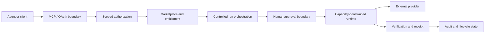
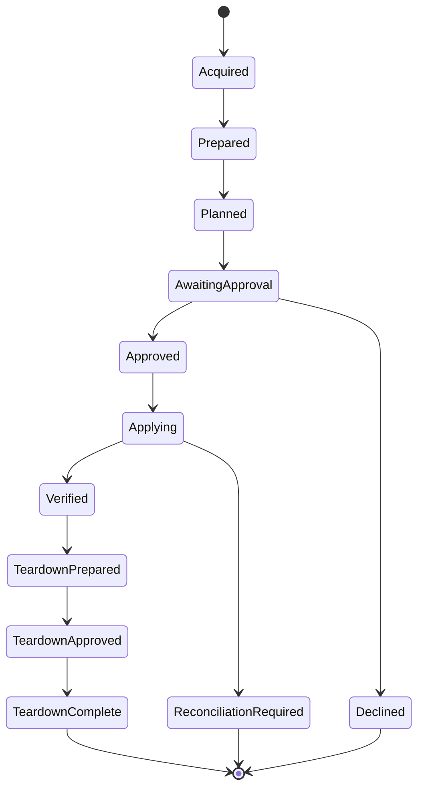

# BoxFetch

## Controlled execution infrastructure for AI agents

BoxFetch addresses a consequential problem in agentic systems: how to let software acquire and execute useful capabilities while keeping money, credentials, infrastructure changes, and deletion under explicit authority.

The implementation remains private. This case study covers the control architecture, the corrections that shaped it, and the evidence used to decide when an execution path is ready.

## My role

I am the founder and technical product lead for BoxFetch. I own the product model, authority architecture, acceptance criteria, and release decisions described here, and I review implementation through source, tests, proof harnesses, and end-to-end system evidence. AI-assisted engineering tools are part of the build workflow; technical direction and acceptance remain mine.

**Period:** active development in 2026.  
**Current status:** the authenticated marketplace and agent surfaces, OAuth/MCP access, controlled-run orchestration, owner approval UI, durable product state, and constrained standalone runtime are implemented. Six canonical BoxFetch Originals exist; one currently has a reviewed hosted execution path, while the others remain acquisition-only until their execution adapters earn separate evidence.

## Problem

Once an agent can create economic or operational consequences, tool access is no longer the hard part. The system has to answer more demanding questions:

- what the agent is authorized to do now
- which decisions require a human
- whether a request can be replayed or duplicated
- what happens after an ambiguous provider response
- whether purchase entitlement implies execution authority
- how permissions step up without silently broadening the rest of the grant
- whether spending limits remain enforceable across repeated actions
- whether durable evidence exists for what was approved, executed, verified, or torn down

## System shape

No single interface owns the full authority chain.

## Core architecture

### Scope model

The system uses OAuth authorization-code flow with PKCE and protected MCP sessions. Access is divided into explicit scopes rather than treating a valid session as universal authority.

The hosted catalog currently contains **15 tools**: eight acquisition-oriented tools and seven controlled-run tools. Run authority is absent from the default acquisition grant, so discovering a capability and being allowed to execute it are separate facts.

### Entitlement versus execution

Marketplace acquisition, entitlement, provider connection, execution planning, human approval, apply, verification, and teardown are distinct states. Purchase therefore does not silently become operational authority.

### Human approval binds to exact state

Approval binds to a specific sealed plan digest. If the underlying plan changes concurrently, the earlier decision cannot authorize the new state. Teardown uses the same principle.

### Replay and economic controls

Mutations require caller-supplied idempotency keys and pass through transactional state transitions. Agent acquisition permissions and spending limits are persisted product controls rather than conversational instructions.

The controlled-run mutation and recovery register currently contains **161 registered cases**, all machine-mapped to their intended proof references. The register separates contract-only coverage from cases that require direct observation, so a green test is not mislabeled as provider evidence.

### Capability-constrained runtime

The standalone runtime uses implementation-specific capability grants with default-deny boundaries for executable access, network destinations, filesystem access, environment exposure, and secret handling. It does not dynamically execute arbitrary package-supplied JavaScript, shell, or plugins.

### Reconciliation as a safety state

A provider request can leave the local system uncertain about what actually happened. BoxFetch represents that ambiguity explicitly. Forward mutation is withheld because automatically retrying an uncertain external mutation can duplicate the consequence.

## Representative lifecycle

`ReconciliationRequired` is a peer of `Verified`, not a retry loop.

## What changed after red-team testing

An earlier agent surface placed capability discovery and executable actions behind an authority boundary that was too broad. Red-team testing showed that session validity, tool visibility, and mutation authority could be too easily conflated.

The architecture was narrowed structurally. Public onboarding, hosted OAuth, acquisition authority, run preparation, execution authority, teardown authority, owner-held provider credentials, and human plan approval were separated. The current seven run tools use a scope ladder that reveals only the next authority boundary instead of walking a client automatically toward mutation or deletion.

The resulting rule is simple: **tool visibility, commercial entitlement, credential possession, and mutation authority are different powers.**

## Validation evidence

The private repository carries separate unit, security-core, operations, and disposable-PostgreSQL proof layers. It includes:

- TypeScript and Python MCP interoperability proofs
- OAuth concurrency, narrowing, step-up, revocation, and abuse-case proofs
- deterministic standalone-runtime artifact verification on every pull request
- controlled-run lifecycle and mutation proof harnesses
- entitlement-delivery and public-onboarding proofs
- explicit provider-call observation where contract tests are insufficient
- a 161-case mutation/recovery register that records which safety properties have direct evidence and which remain outstanding

A deterministic runtime proof builds the distributed Node 22 ESM artifact independently from the source tree, inspects its dependency closure and bytes, and exercises all six delivered packages against approval and capability boundaries.

## Technology

- TypeScript
- Next.js and React
- Node.js 22
- PostgreSQL
- Drizzle ORM
- MCP SDK
- OAuth 2.0 authorization code flow with PKCE
- Vitest
- Zod
- Stripe in the commercial transaction plane

## Current boundary

BoxFetch currently supports a working controlled-execution architecture and one reviewed hosted execution path. Additional provider paths remain closed pending separate adapter, capability-grant, direct-observation, and live-canary evidence. Arbitrary third-party code execution and universal provider coverage are outside the current system surface.

The engineering problem is preserving useful agent autonomy while keeping spending, mutation, credentials, approval, retries, and deletion under explicit authority.

[Architecture](ARCHITECTURE.md) · [Technical decisions](TECHNICAL_DECISIONS.md) · [Validation](VALIDATION.md) · [Back to profile](https://github.com/Andy11-cpu)
