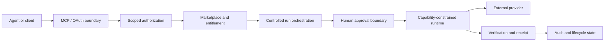
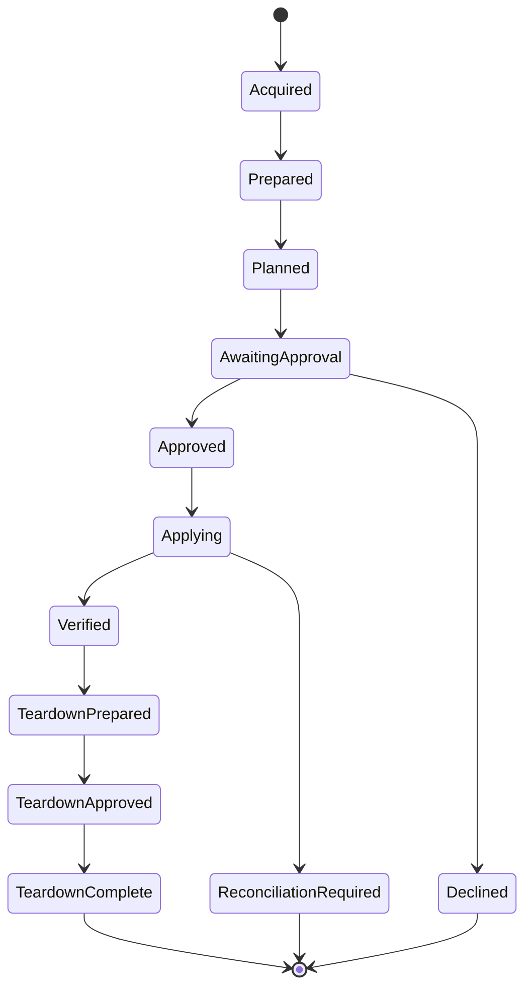

# BoxFetch

## Controlled execution infrastructure for AI agents

BoxFetch addresses a narrow but consequential problem: how to let software agents acquire and execute useful capabilities without giving them unrestricted authority over money, credentials, infrastructure, or deletion.

The private product repository contains the full implementation. This public case study documents the architecture, control model, design decisions, corrections, and validation strategy without publishing proprietary source code or security-sensitive operational detail.

## My role

I am the founder and technical product lead for BoxFetch. I own the product model, authority architecture, acceptance criteria, and release decisions described here, and I review implementation through source, tests, proof harnesses, and end-to-end system evidence. Development uses AI-assisted engineering tools under my direction; this is not a claim that I personally typed every line of the implementation.

**Period:** active development in 2026.  
**Current status:** authenticated marketplace and agent surfaces, OAuth/MCP access, controlled-run orchestration, owner approval UI, durable product state, and a constrained standalone runtime are implemented. Six canonical BoxFetch Originals exist; one currently has a reviewed hosted execution path while the others remain acquisition-only until their execution adapters earn separate evidence.

## Problem

Most agent systems are easy to make impressive in a demo and difficult to make trustworthy once they can create economic or operational consequences. The harder questions are not whether an agent can call a tool, but whether the system can answer:

- what the agent is authorized to do now
- which decisions require a human
- whether a request can be replayed or duplicated
- what happens after an ambiguous provider response
- whether purchase entitlement implies execution authority
- how permissions can step up without silently broadening the rest of the grant
- whether spending limits remain enforceable across repeated actions
- whether durable evidence exists for what was approved, executed, verified, or torn down

## System shape

No single interface owns the full authority chain.

## Core architecture

### Scope model

The system supports OAuth authorization-code flow with PKCE and protected MCP sessions. Access is divided into explicit scopes rather than treating a valid session as universal authority.

The hosted catalog currently contains **15 tools**: eight acquisition-oriented tools and seven controlled-run tools. The run tools sit behind authorities that are absent from the default acquisition grant, so discovering a capability and being allowed to execute it are separate facts.

### Entitlement versus execution

Marketplace acquisition, entitlement, provider connection, execution planning, human approval, apply, verification, and teardown are distinct states. Purchase therefore does not silently become operational authority.

### Human approval binds to exact state

Approval is not a generic yes or no. A human decision binds to a specific sealed plan digest. If the underlying plan changes concurrently, the earlier decision cannot authorize the new state. Teardown uses the same principle.

### Replay and economic controls

Mutations require caller-supplied idempotency keys and pass through transactional state transitions. Agent acquisition permissions and spending limits are persisted product controls rather than conversational instructions.

The controlled-run mutation and recovery register currently contains **161 registered cases**, all machine-mapped to their intended proof references. The register distinguishes contract-only coverage from cases that require direct observation, so a green test is not mislabeled as provider evidence.

### Capability-constrained runtime

The standalone runtime uses implementation-specific capability grants with default-deny boundaries for executable access, network destinations, filesystem access, environment exposure, and secret handling. It does not dynamically execute arbitrary package-supplied JavaScript, shell, or plugins.

### Reconciliation is a safety state

A provider request can leave the local system uncertain about what actually happened. BoxFetch represents that ambiguity explicitly. Forward mutation is withheld rather than automatically retried, because retrying an uncertain external mutation can duplicate the consequence.

## Representative lifecycle

`ReconciliationRequired` is intentionally a peer of `Verified`, not a retry loop.

## A design that changed

The early agent surface was too permissive in how capability discovery and authority could meet. Red-team work showed that a broad tool surface made it too easy to reason about a valid session as though it implied useful authority over every exposed action.

The architecture was narrowed rather than patched cosmetically. Public onboarding, hosted OAuth, acquisition authority, run preparation, execution authority, teardown authority, owner-held provider credentials, and human plan approval were separated. The current seven run tools use a scope ladder that reveals only the next authority boundary rather than walking a client automatically toward mutation or deletion.

The lesson was structural: **tool visibility, commercial entitlement, credential possession, and mutation authority are different powers.** The implementation now treats them that way.

## Validation evidence

The private repository carries separate unit, security-core, operations, and disposable-PostgreSQL proof layers. It includes:

- TypeScript and Python MCP interoperability proofs
- OAuth concurrency, narrowing, step-up, revocation, and abuse-case proofs
- deterministic standalone-runtime artifact verification on every pull request
- controlled-run lifecycle and mutation proof harnesses
- entitlement-delivery and public-onboarding proofs
- explicit provider-call observation where contract tests are insufficient
- a 161-case mutation/recovery register that records which safety properties have direct evidence and which remain outstanding

A deterministic runtime proof builds the distributed Node 22 ESM artifact independently from the source tree, inspects its dependency closure and bytes, and exercises all six delivered packages against approval and capability boundaries.

## Technology

- TypeScript
- Next.js and React
- Node.js 22
- PostgreSQL
- Drizzle ORM
- MCP SDK
- OAuth 2.0 authorization code flow with PKCE
- Vitest
- Zod
- Stripe in the commercial transaction plane

## Current boundary

BoxFetch has a working controlled-execution architecture and one executable hosted integration path. It does **not** claim arbitrary third-party code execution, universal provider coverage, or that every integration has completed a real production canary. Additional execution paths remain closed until their adapter, capability grant, and evidence are separately reviewed.

The interesting engineering problem is not the marketplace itself. It is preserving useful agent autonomy while keeping spending, mutation, credentials, approval, retries, and deletion under explicit authority.

[Architecture](ARCHITECTURE.md) · [Technical decisions](TECHNICAL_DECISIONS.md) · [Validation](VALIDATION.md) · [Back to profile](https://github.com/Andy11-cpu)
