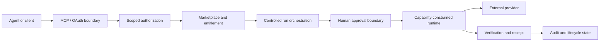
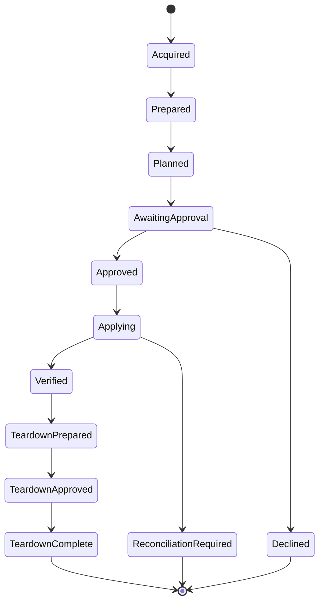

# BoxFetch

## Controlled execution infrastructure for AI agents

BoxFetch explores a narrow but consequential problem: how to let software agents acquire and execute useful capabilities without giving them unrestricted authority over money, credentials, infrastructure, or deletion.

The private product repository contains the full implementation. This public case study documents the architecture, control model, design decisions, and validation strategy without publishing proprietary source code or security-sensitive operational detail.

## Problem

Most agent systems are easy to make impressive in a demo and difficult to make trustworthy in production. The risk is not only whether an agent can call a tool. The harder questions are:

- What is the agent actually authorized to do?
- Which decisions require a human?
- Can a request be replayed or duplicated?
- What happens after an ambiguous provider response?
- Can a purchased capability be used without exposing credentials?
- Can permissions be stepped up without silently broadening everything else?
- Is there durable evidence of what was approved, executed, verified, or torn down?

BoxFetch treats those questions as first-class product architecture.

## System shape

The important property is that no single interface owns the full authority chain.

## Core architecture

### 1. Authorization is narrower than discovery

The system supports OAuth authorization-code flow with PKCE and protected MCP sessions. Access is divided into explicit scopes rather than treating a valid session as universal authority.

The controlled-run lifecycle uses separate authorities for reading run state, executing a reviewed plan, and performing teardown. Incremental scope escalation is deliberate. A client can discover that more authority is required without automatically receiving it.

### 2. Purchase does not imply execution

Marketplace acquisition, entitlement, provider connection, execution planning, human approval, apply, verification, and teardown are distinct states.

That separation prevents a common failure mode in agent products: treating commercial entitlement as operational authorization.

### 3. Human decisions bind to exact state

Approval is not a generic yes or no. A human decision binds to a specific sealed plan digest. If the underlying plan changes concurrently, the prior approval cannot silently authorize the new state.

The same principle applies to teardown.

### 4. Mutations are replay-safe

Caller-supplied idempotency keys are required for mutations. The product uses transactional state transitions and concurrency controls so repeated requests do not become repeated economic or provider actions.

Ambiguous dispatched mutations are treated as reconciliation problems, not as invitations to retry automatically.

### 5. Runtime authority is capability-constrained

The execution runtime is intentionally hostile to arbitrary package behavior. It uses implementation-specific capability grants and default-deny boundaries for processes, network destinations, filesystem access, environment exposure, and secret handling.

The runtime does not dynamically execute arbitrary package-supplied JavaScript, shell, or plugins.

### 6. Secrets and evidence are different planes

Credentials and secret values are not included in public projections, receipts, or ordinary agent-visible state. The system records enough evidence to explain lifecycle state without turning observability into a leakage channel.

## Representative lifecycle

This is intentionally more explicit than a simple `run()` abstraction. The complexity exists because external mutation, money, credentials, and human authority are not interchangeable states.

## Technology

The private implementation uses:

- TypeScript
- Next.js and React
- Node.js 22
- PostgreSQL
- Drizzle ORM
- MCP SDK
- OAuth 2.0 authorization code flow with PKCE
- Vitest
- Zod
- Stripe in the commercial transaction plane

The repository also contains disposable proof harnesses for MCP interoperability, OAuth concurrency and abuse cases, entitlement delivery, controlled-run behavior, public onboarding, and provider-facing execution boundaries.

## Design decisions

### Fail closed when authority is ambiguous

If the system cannot prove that an actor owns a resource, holds the required entitlement, has the required scope, or is acting on the exact approved plan, the operation does not proceed.

### Separate owner authority from agent authority

An external agent can request and inspect parts of a controlled-run lifecycle, but cannot supply the owner's provider credential or manufacture the human approval that authorizes a provider mutation.

### Treat reconciliation as a terminal safety state

A provider request can leave the local system uncertain about what actually happened. Retrying in that state can duplicate a mutation. BoxFetch instead surfaces reconciliation explicitly and removes forward mutation affordances until ambiguity is resolved.

### Make execution format publisher-neutral

The runtime model is designed around reviewed capabilities rather than assuming that one publisher or one package family should receive structurally different execution semantics.

## Validation philosophy

Validation is layered rather than reduced to one green test suite:

1. Unit and security-core tests for local invariants.
2. Disposable proof environments for lifecycle and protocol behavior.
3. Interoperability proofs for TypeScript and Python MCP clients.
4. Explicit operator-only checks for database, deployed-origin, staging, and provider behavior.
5. Separate live-canary status so code readiness is not mislabeled as production proof.

This distinction matters. A passing test suite can prove implementation properties. It cannot prove that a real provider mutation happened correctly unless that action was actually performed and observed.

## Current boundary

BoxFetch contains a working controlled-execution architecture and a reviewed executable integration path, but the public case study does not claim universal provider coverage or arbitrary third-party code execution. Several product capabilities remain deliberately acquisition-only until each execution path has its own reviewed adapter and evidence.

## What this case study demonstrates

The project is less about building another tool marketplace than about reasoning through authority in agentic systems. The central engineering problem is how to preserve usefulness while constraining what an automated actor may spend, mutate, disclose, approve, retry, or delete.

That problem generalizes well beyond BoxFetch. It appears anywhere AI systems cross from recommendation into action.

[Architecture](ARCHITECTURE.md) · [Technical decisions](TECHNICAL_DECISIONS.md) · [Validation](VALIDATION.md) · [Back to profile](https://github.com/Andy11-cpu)
